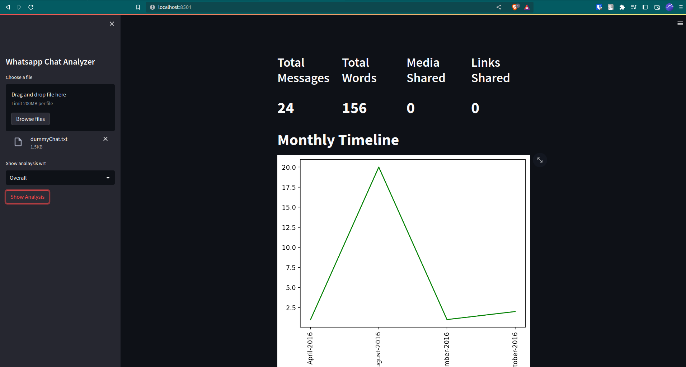
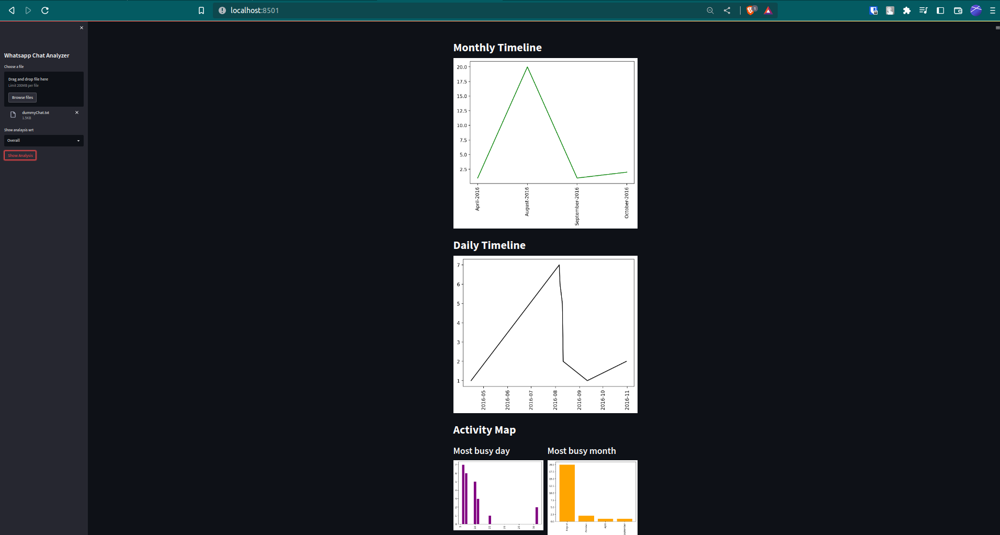

# Whatsapp-Chat-Analysis

### Software and Tools Requirement
1. [Github-Account](https://github.com)
2. [Render-Account](https://render.com/)
3. [Vs-Code-IDE](https://code.visualstdio.com)
4. [Git-CLI](https://git-scm.com/book/en/v2/Getting-Started-The-Command-Line)

### Create new environment

```
conda create -p venv python==3.7 -y
```

### Install all required packages
```
pip install -r requirements.txt
```

### Run the application on your local machine
```
streamlit run app.py
```

### Sample of running application





[click-to-check-the-project](https://whatsapp-chat-analysis-g6z6.onrender.com)


--------------------------------------- END -----------------------------------------------

### Thanks!!